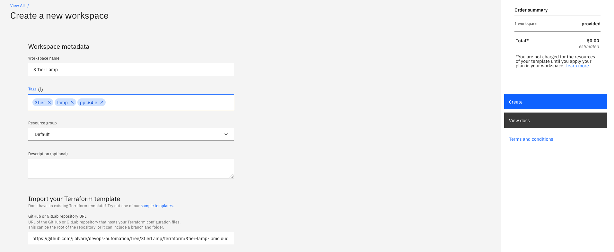
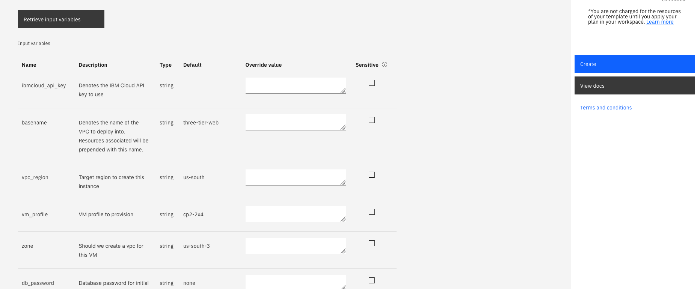
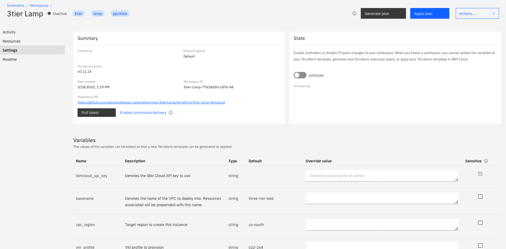
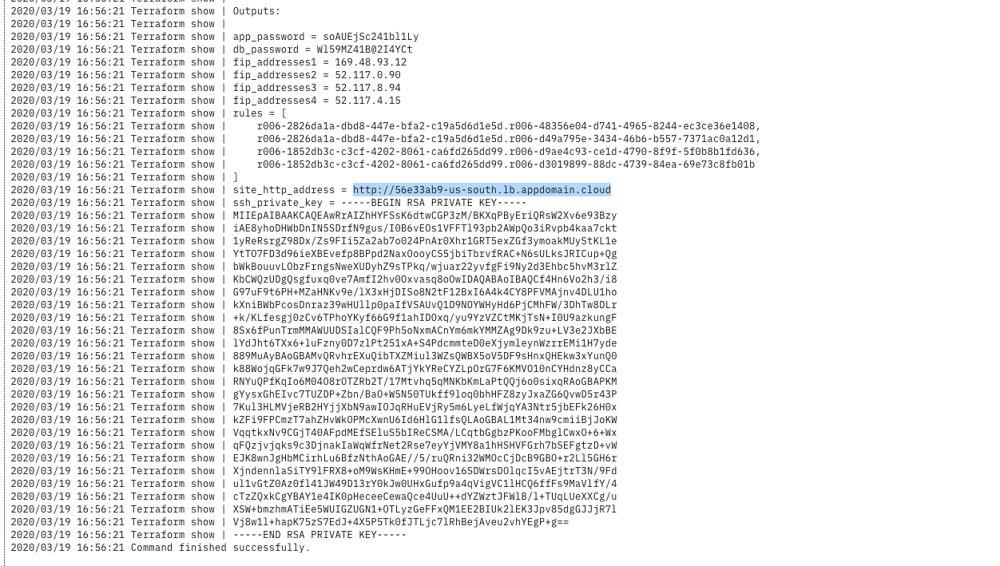
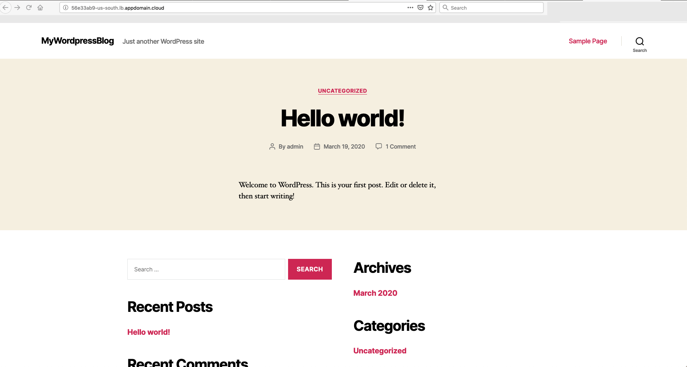

# Deploy a 3 Tier Web Application using Terraform on IBM Cloud VPC 

Deploy a 3 Tier Wordpress Application on Ubuntu 18.04 ppc64le running in IBM Cloud VPC.
This template follows the [3tier VPC API example](https://github.com/ibm-cloud-architecture/tutorial-vpc-3tier-networking/blob/master/API.md) provided in IBM Cloud.  


## Prerequisites 

1. Terraform = 0.11.14 
2. IBM Cloud Terraform Provider = 0.20.0 
3. IBM Cloud API Key with authorization to provision in IBM Cloud VPC and IBM Cloud Block Storage for VPC 

## Overview

This deployment provisions:
  1. a Linux Ubuntu ppc64le VM server on IBM Cloud VPC 
  2. Creates a new ssh key to login 
  3. Opens Ports 80, 443 in VPC Security Group port to access web page 
  4. Opens Ports 22 to access SSH console
  5. Sets up Redundant Wordpress instances and starts services
  6. Sets up Redundant MySQL instances and starts services 
  7. Sets up a Load Balancer for redundant Wordpress instances 

After install you can access the Wordpress web page by the load balancer:

    http://<random_generated_number>-<country>-<region>.lb.appdomain.cloud/  

To run the example, you will need to:

1. Clone this Git repository
2. [Download and configure](https://github.com/IBM-Cloud/terraform-provider-ibm) the IBM Cloud Terraform provider (minimally v0.20.0 or later)
3. Obtain your [IBM Cloud API key](https://cloud.ibm.com) (needed for step #4)
4. Update the variables.tf file to suit your needs

## Provision Environment in IBM Cloud with IBM Cloud Schematics 

### Create workspace 

### Input Schematics Variables

### Apply Workspace 

### Retrieve Login information

### Access Wordpress Application 


## Provision Environment in IBM Cloud with terraform
Next, you can run the example by invoking...

The planning phase (validates the Terraform configuration)

```shell
terraform init
terraform plan
```

The apply phase (provisions the infrastructure)

```shell
terraform apply
```

The destroy phase (deletes the infrastructure)

```shell
terraform destroy
```


