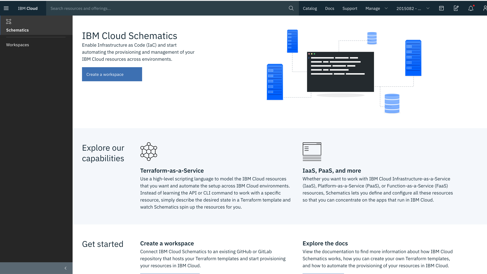
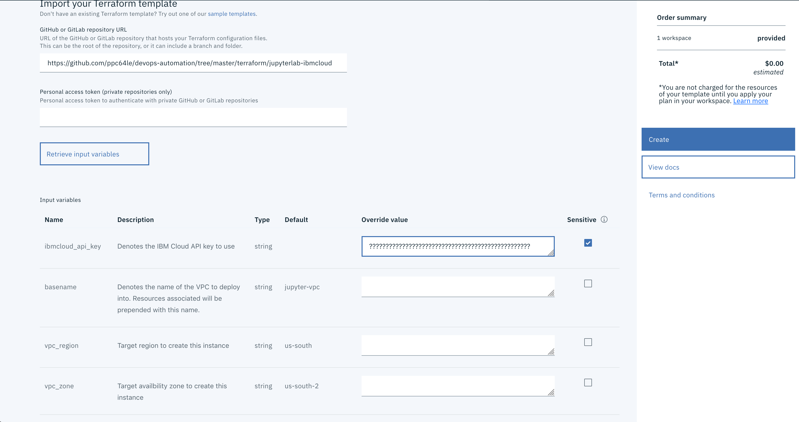
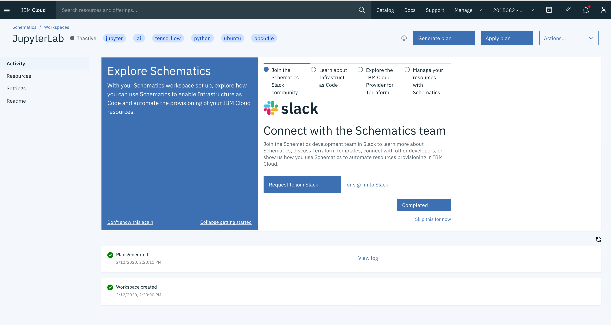
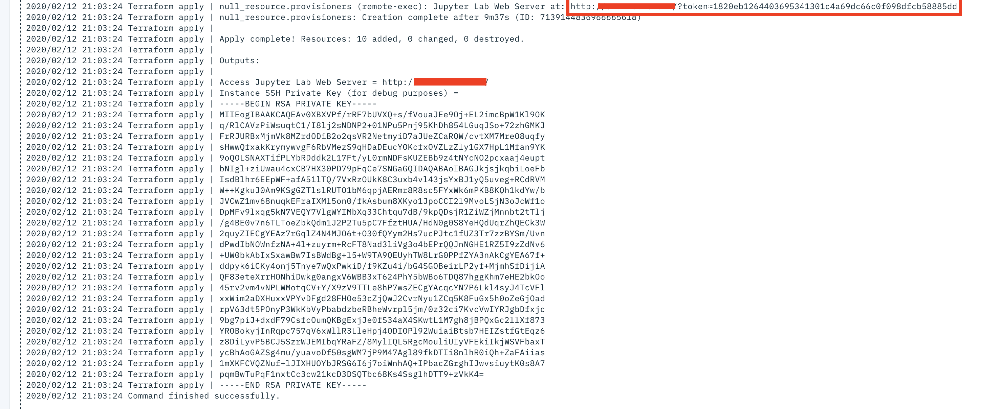
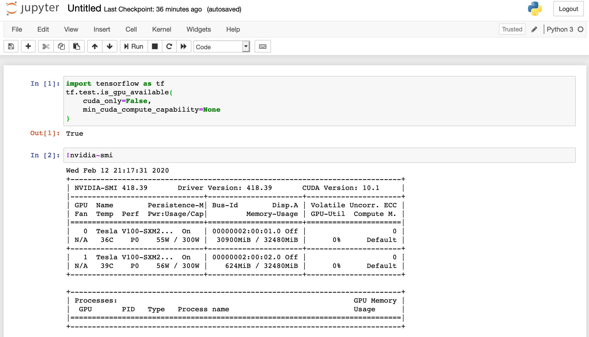
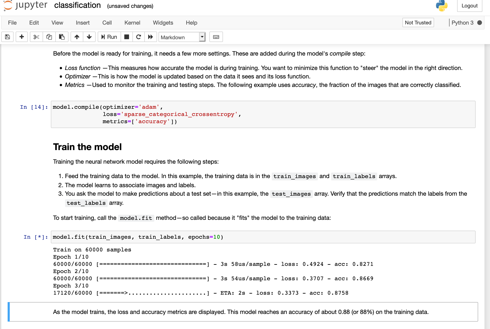

# Deploy a JupyterLab Workspace on IBM Cloud VPC 

Deploy a JupyterLab on Ubuntu 18.04 ppc64le running in IBM Cloud VPC. Within a JupyterLab one can run Python code interactively,
enable code in a text file for scientific research, drop down into a bash terminal, in a flexible and integrated manner. 
Whats even more exciting this JuypterLab is setup to support GPU workloads where you can train your Artificial Intelligence 
model at very fast speeds, literally supercomputer fast.

## Prerequisites 

1. Terraform >= 0.11.14 
2. IBM Cloud Terraform Provider >= 0.20.0 
3. IBM Cloud API Key with authorization to provision in IBM Cloud VPC 

## Overview

This deployment:
1. Creates a Linux Ubuntu ppc64le VM server on IBM Cloud VPC 
2. Creates a new ssh key to login 
3. Opens Ports 80, 443 in VPC Security Group port to access the JupyterLab Workspace 
4. Opens Port 22 to access SSH console
5. Sets up GPU Driver 418.39 and starts services
6. Loads CUDA 10.1 Libraries to interact in docker environment
7. Downloads JupyterLab from Docker hub: ibmcom/tensorflow-ppc64le:1.15.0-gpu-py3-jupyter
8. Run ibmcom/tensorflow-ppc64le:1.15.0-gpu-py3-jupyter as tensorflow-gpu-jupyter

### Install Complete 
After install you can access the default JupyterLab web page of Ubuntu VM by IP:

    http://<IP>/?token=<token> 

The token can be found in your output of Terraform:

```console
null_resource.provisioners (remote-exec): Jupyter Lab Web Server at: http://192.168.1.68/?token=72d5sometokenwithaverylongnumberbae1c53
```


### Validate GPUs are correctly loaded 
#### Notebook 

```python
import tensorflow as tf
tf.test.is_gpu_available(
    cuda_only=False,
    min_cuda_compute_capability=None
)
```

## Run template
To run the example, you will need to:

1. Clone this Git repository
2. [Download and configure](https://github.com/IBM-Cloud/terraform-provider-ibm) the IBM Cloud Terraform provider (minimally v0.20.0 or later)
3. Obtain your [IBM Cloud API key](https://cloud.ibm.com) (needed for step #4)
4. Update the variables.tf file to suit your needs

## Provision Environment in IBM Cloud Schematics 
### Create Workspace 

### Click Retrieve Input Variables and Insert IBM Cloud API Key 

### Generate Plan and Apply Plan 

### Access JupyterLab 
#### Get Token from Schematics Output 

#### Access JupyterLab in Browser 

### Verify GPUs 

### Run Tensorflow Sample Notebook 

## Provision Environment in IBM Cloud with Terraform
Next, you can run the example by invoking...

The planning phase (validates the Terraform configuration)

```shell
terraform init
terraform plan
```

The apply phase (provisions the infrastructure)

```shell
terraform apply
```

The destroy phase (deletes the infrastructure)

```shell
terraform destroy
```
