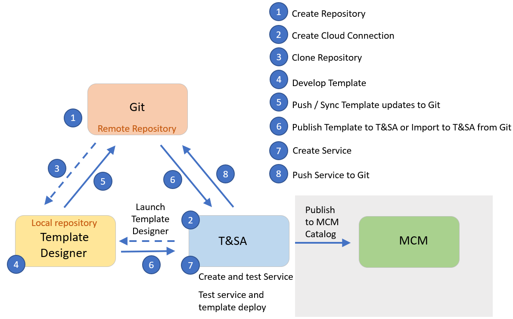
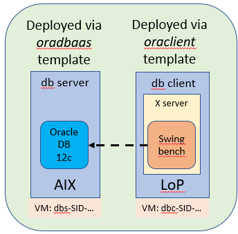

# cam-demo
Demonstrate IBM Terraform & Service Automation (also known as _IBM Cloud Automation Manager_) functionality, deployed into Red Hat Openshift Container Platform environment via IBM Cloud Pak for Multicloud Management, to deploy orchestrated VMs to IBM PowerVC managed environments.

This project builds on the Proof of Technology described in “Deploying Oracle® Database as a Service with IBM Cloud PowerVC Manager" where we demonstrate how IBM Cloud PowerVC Manager (PowerVC) technology enables the implementation of Database-as-A-Service (DBaaS) for an Oracle® database. See sister project: [*powervc-oradbaas*](https://github.com/ppc64le/devops-automation/oracle/powervc-oradbaas)

In the first section we demonstrate how to utilize IBM Terraform & Service Automation (T&SA), instead of PowerVC, to provide the control point and end-user interface for DBaaS for an Oracle database, while re-using the existing PowerVC image developed in the sister project. The template related files for this part can be found in: [*oradbaas*](https://github.com/ppc64le/devops-automation/oracle/cam-ora/oradbaas).

We then expand the scope and illustrate the workload orchestration capabilities of T&SA by creating a deployable service which co-deploys two virtual machines (VM) - a database server and an application server. The result of that orchestrated deployment is a running and pre-loaded oracle database and a workload driver in the second VM ready for the end-user to connect to and drive simulated transactions against the database. The template related files for this part can be found in: [*oraclient*](https://github.com/ppc64le/devops-automation/oracle/cam-ora/oradbaas) and, for the service definition, in [*oradbsc*](https://github.com/ppc64le/devops-automation/oracle/cam-ora/oradbaas).

Familiarity with Red Hat Openshift Container Platform (OCP), IBM Cloud Pak for Multicloud Management (MCM), IBM Terraform & Service Automation v4.2 (T&SA), IBM Power environment, IBM Power Virtualization Center (PowerVC), AIX and Linux system administration is assumed. The creation of the deployable image for the Oracle database server, as described in [*powervc-oradbaas*](https://github.com/ppc64le/devops-automation/oracle/powervc-oradbaas), requires working knowledge of Oracle 12c database software.

# Prerequisites
* Installed and working IBM PowerVC 1.3.1 or later install with IBM Power servers and PowerVC controlled storage
* Deployable Oracle DBaaS image in PowerVC and created as described in sister project [*powervc-oradbaas*](https://github.com/ppc64le/devops-automation/oracle/powervc-oradbaas)
* Installed Red Hat Openshift Container Platform 3.11 on IBM Power (OCP 4.x should work as well)
* Installed IBM Terraform & Service Automation v4.2 (T&SA) deployed into IBM Cloud Pak for Multicloud Management 
* NFS server to stage Oracle client and Swingbench software
* Linux on Power deployable image supported with Oracle Instant Client software
    * See [Oracle Database Documentation](https://docs.oracle.com/en/database/oracle/oracle-database/index.html), select Oracle database release and then go to the _Install and Upgrade_ topic which includes a section for supported operating system releases for the Oracle Instant Client release.
    * We utilized Red Hat® Enterprise Linux Server 7.6 LE in our testing.

# How to get started
See [OCP_Terraform&ServiceAutomation_OraDBaaS.pdf](./OCP_Terraform&ServiceAutomation_OraDBaaS.pdf) for implementation details and step-by-step directions. If you do not yet have Terraform & Service Automation installed, select the _ibm-cam_ (IBM Cloud Automation Manager) Helm chart from the MCM catalog and deploy it.

The following figure illustrates the development steps of this project.

The next figure shows the result of the orchestrated deploy of *oradbaas* and *oraclient* from either CAM or ICP catalog.

