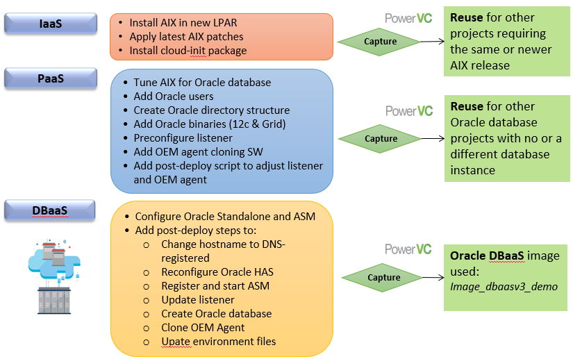

# Deploying Oracle® Database as a Service with IBM Cloud PowerVC Manager

In this project we develop a sample implementation for Oracle Database as a Service proof of technology (PoT) in a private cloud model.

The PoT was developed by the IBM Washington Systems Center (WSC), North America Power - Oracle Solutions team and illustrates how a fully functional Oracle Database 12c with ASM on AIX can be deployed, without human intervention, in less than 30 minutes after the end-user request was approved.
This PoT utilizes IBM Power servers, HMC, IBM PowerVM, IBM PowerVC, AIX 7.2 and IBM Storwize V7000 in a fully virtualized configuration implemented to provide private cloud functionality.

Familiarity with the IBM Power environment, IBM PowerVC, AIX system administration, Oracle Database 12c and Oracle Grid Infrastructure 12c is assumed.

# Prerequisites
* Installed and working IBM PowerVC 1.3.1 or later install with IBM Power servers and PowerVC vontrolled storage
* AIX 7.x install software
* Oracle 12c database and grid software for AIX

# How to get started
See __Deploy_Oracle DBaaS_with_PowerVC131_v1.0.pdf__ for implementation details. All developed support scripts to implement Oracle Database as a Service are included.

The following figure illustrates the steps required to build the full PowerVC image for Oracle DBaaS functionality.

The next figure shows the VM and storage configuration after the successful deployment of the developed Oracle DBaaS image. This deployed configuration is production-ready and adheres to Oracle best practices for a single instance Oracle database with Oracle ASM.

