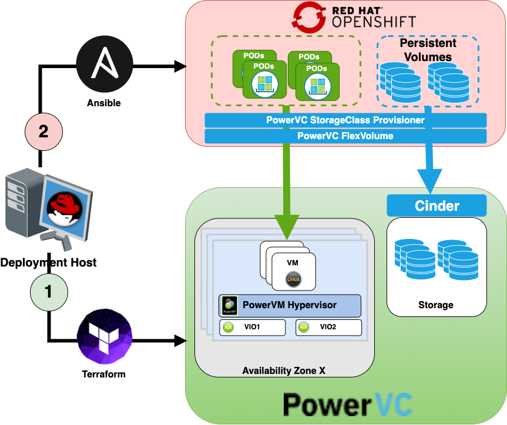

# OpenShift Container Platform 3.11 on PowerVC

Use this example to set up Red Hat® OpenShift Container Platform 3.11 on PowerVC.

## Overview

Deployment of 'OpenShift Container Platform on PowerVC' is a two steps process:

* **Step 1**: Provision the infrastructure on PowerVC <br>
  Use Terraform to provision the network, compute, storage on PowerVC.
  
* **Step 2**: Install OpenShift Container Platform <br>
  Use openshift-ansible playbooks to install OpenShift Container Platform (OCP) version 3.11

The following figure illustrates the deployment process for the 'OpenShift Container Platform on PowerVC'.

<p align="center">
  
</p>

## Prerequisite

* RedHat Account with openshift subscription.
* Deployment Host/VM running terraform and openshift-ansible.
* PowerVC installed and configured.

## Steps for deploying the OpenShift Container Platform

### Clone the repo [OpenShift Container Platform 3.11 on PowerVC](https://github.com/ppc64le/devops-automation.git):

```shell
# Clone the repo
git clone git clone https://github.com/ppc64le/devops-automation.git
cd devops-automation/powervc-openshift/
```

### Deploy PowerVC infrastructure:

* Create terraform.tfvars file. There are 4 example files:
    
    - **terraform_aio.tfvars.example**      - All In One Deployment example This will create a network and 1xVM for Master-Infra-Worker(applications) Node.
    - **terraform_3nodes.example**          - 3 Nodes Deployment example This will create a network, 1xVMs for Master-Infra Nodes and 2xVMs Workers(Applications) Nodes.
    - **terraform_7nodes.tfvars.example**   - 7 Nodes Deployment example This will create a network, 3xVMs for Master-Infra Nodes, 3xVMs Workers(Applications) Nodes and 1xVM for LoadBalancer Node.
    - **terraform_10nodes.tfvars.example**  - 10 Nodes Deployment example This will create a network, 3xVMs for Master Nodes, 3xVMs for Infra Nodes, 3xVMs Workers(Applications) Nodes and 1xVM for LoadBalancer Node.


**Note:** Master, Inafra and Worker VMs has an additional disk (/dev/mapper/DOCKER_DISK_1) for docker-vg volume group.<br>
**Note:** If you want to use an existing network, you need to remove the network.tf file before applying the configuration.


* Deploy Infrastructure:

```shell
# initialize terraform a working directory
terraform init
# create an execution plan
terraform plan
# apply the changes required to reach the desired state
terraform apply
```

### Install OpenShift Container Platform:

* Create ansible inventory file. There are 4 example files:
        
    - **aio.inv.example**       - This All-in-One (AIO) is not an officially supported OCP deployment. The AIO configuration is considered a testing or development environment. The Master, Infrastructure and Application Roles are deployed to a single node.
    - **3nodes.inv.example**    - 1x Master-Infra Nodes and 2x Workers (Application Nodes).
    - **7nodes.inv.example**    - 3x Master-Infra Nodes, 3x Workers (Application Nodes) and 1 Load Balancer (HAProxy) Node.
    - **10nodes.inv.example**   - 3x Master Nodes, 3x Infra Nodes, 3x Workers (Application Nodes) and 1 Load Balancer (HAProxy) Node.

**Note:** The HAProxy load balancer is intended to demonstrate the API server’s HA mode and is not recommended for production environments. 

* Register OpenShift VMs to the RHSM, attach pool ID and enable repositories:

```shell
# Check VM access:
ansible -i <inventory_file> nodes,lb  -m ping
# Register VMs to RHSM:
ansible -i <inventory_file> nodes,lb  -a 'subscription-manager register --username={{REGISTRY_SERVICE_ACCOUNT}}}} --password={{SERVICE_KEY}}'
# Attach POOL ID:
ansible -i  <inventory_file> nodes,lb -a 'subscription-manager attach --pool={{POOL_ID}}'
# Repository configuration for POWER9:
ansible -i  <inventory_file> nodes,lb -a 'subscription-manager repos --disable="*" --enable="rhel-7-for-power-9-rpms" --enable="rhel-7-for-power-9-extras-rpms" --enable="rhel-7-for-power-9-optional-rpms" --enable="rhel-7-server-ansible-2.6-for-power-9-rpms" --enable="rhel-7-server-for-power-9-rhscl-rpms" --enable="rhel-7-for-power-9-ose-3.11-rpms"'
```

* Prepare the VMs for OpenShift installation:

```shell
ansible-playbook -i <inventory_file> /usr/share/ansible/openshift-ansible/playbooks/prerequisites.yml
```

* Install OpenShift Container Platform:

```shell
ansible-playbook -i <inventory_file> /usr/share/ansible/openshift-ansible/playbooks/deploy_cluster.yml
```

### Steps for deploying the IBM PowerVC FlexVolume Driver

```shell
#Create a new project where you are deploying your PowerVC FlexVolume Driver:
export NS=powervc-flexvoldrv
oc login -u system:admin
oc new-project $NS --description="PowerVC FlexVolume Driver for Containers" --display-name="PowerVC FlexVolume Driver"
oc project $NS
#Patch the project to clear the nodeSelector tag by entering the following command:
oc patch namespace $NS -p '{"metadata": {"annotations": {"openshift.io/node-selector": ""}}}'
#Assign the cluster-admin role to the $NS project’s default service account by entering the following command:
oc adm policy add-cluster-role-to-user cluster-admin system:serviceaccount:$NS:default
#Set the hostmount-anyuid source code control to the user root, or the user ID that was used to create the $NS project by entering the following command:
oc adm policy add-scc-to-user hostmount-anyuid system:serviceaccount:$NS:default
#Create a secret with the PowerVC username and password:
oc create secret generic -n $NS powervc-secret \
    --from-literal=OS_USERNAME=ocpadmin \
    --from-literal=OS_PASSWORD=<password>
#Download OpenShift template:
wget https://raw.githubusercontent.com/IBM/power-openstack-k8s-volume-driver/master/template/ibm-powervc-k8s-volume-driver-template.yaml
#Create an environment file:
cat > ibm-powervc-k8s-volume-driver.env <<EOF_ibm-powervc-k8s-volume-driver.env
OPENSTACK_IP_OR_HOSTNAME=X.X.X.X
OPENSTACK_CRED_SECRET_NAME=powervc-secret
OPENSTACK_CERT_DATA=-----BEGIN CERTIFICATE----- .... -----END CERTIFICATE-----
OPENSTACK_PROJECT_NAME=ocp-project
IMAGE_PROVISIONER_REPO=ibmcom/power-openstack-k8s-volume-provisioner
IMAGE_PROVISIONER_TAG=1.0.2
IMAGE_FLEX_VOLUME_REPO=ibmcom/power-openstack-k8s-volume-flex
IMAGE_FLEX_VOLUME_TAG=1.0.2
SECURITY_SERVICE_ACCOUNT_NAME=default
EOF_ibm-powervc-k8s-volume-driver.env
#Deploy the PowerVC FlexVolume Driver application from template using environment file:
oc process -f ibm-powervc-k8s-volume-driver-template.yaml --param-file=ibm-powervc-k8s-volume-driver.env |  oc create -f -
#Verify the deployment:
oc get pod
```

### Creating the Persistent Storage for the Registry

```shell
#Create Persistent Volume Claim:
oc login -u system:admin
oc project default
cat > registry-pvc.yml <<EOF_/registry-pvc.yml
kind: PersistentVolumeClaim
apiVersion: v1
metadata:
  name: registry-pvc
spec:
  accessModes:
    - ReadWriteOnce
  resources:
    requests:
      storage: 256Gi
EOF_/registry-pvc.yml
oc create -f registry-pvc.yml
oc get pvc
oc get dc
oc get pods
oc set volume dc/docker-registry
#Assign Persistent Volume Claim to the Registry:
oc set volume dc/docker-registry --add --name=registry-storage -t pvc --claim-name=registry-pvc --mount-path=/registry --overwrite
oc set volume dc/docker-registry
oc get pod
```

## Steps for destroying the OpenShift Container Platform

* Unregister OpenShift VMs from the RHSM:

```shell
ansible -i  <inventory_file> nodes,lb  -a 'subscription-manager remove --all'
ansible -i  <inventory_file> nodes,lb  -a 'subscription-manager unregister'  
ansible -i  <inventory_file> nodes,lb  -a 'subscription-manager clean'
```

* Destroy PowerVC infrastructure:

```shell
terraform destroy
```
